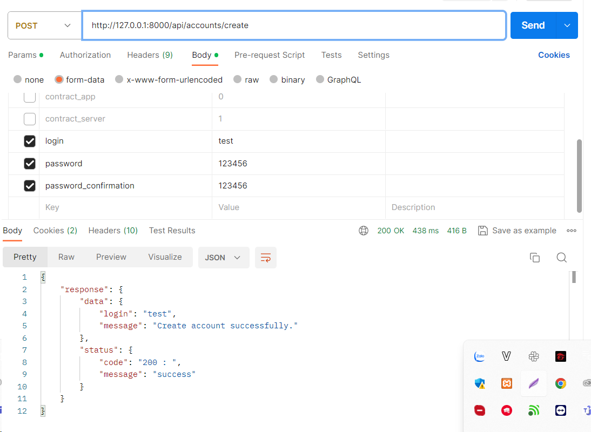
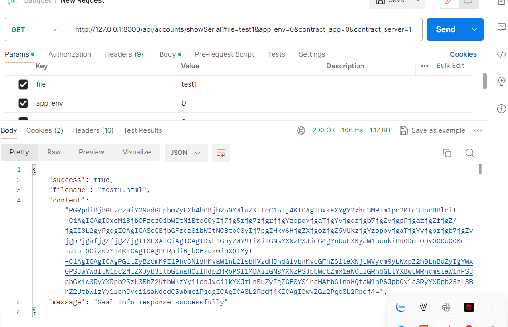
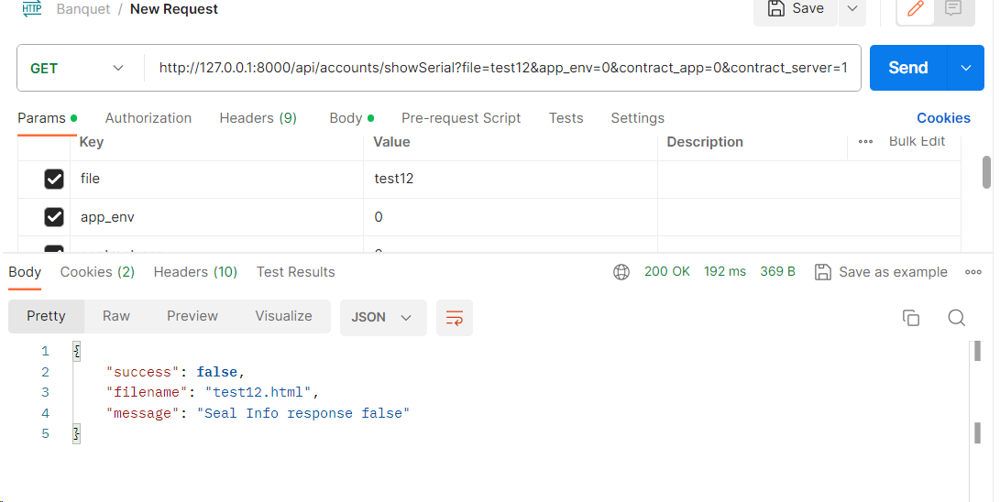
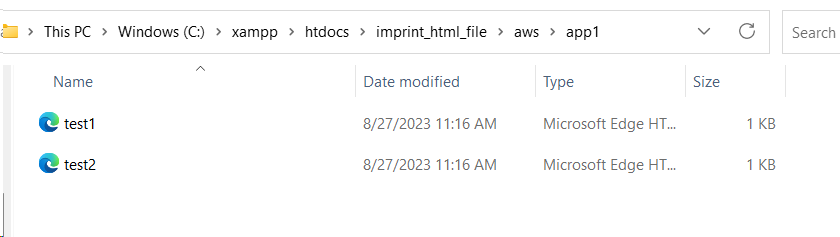
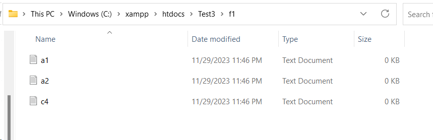
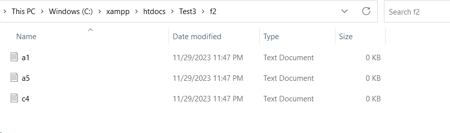
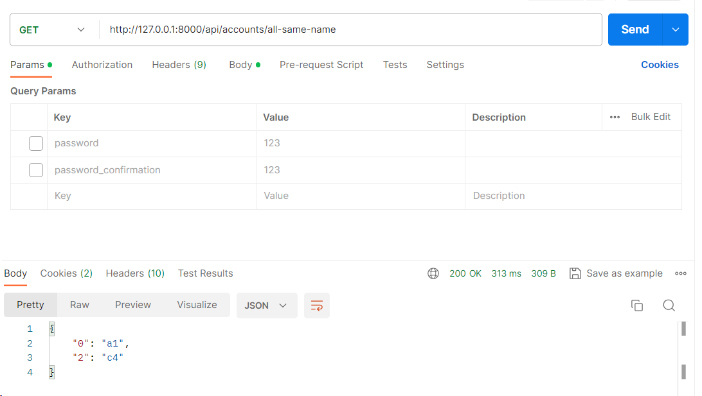
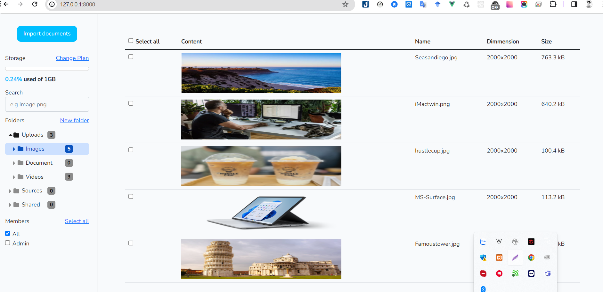

# MiraiTest
I. Setup and build project 
### Laravel
    composer install
    cp .env.example .env
    php artisan key:generate
    php artisan migrate
    php artisan serve
### Vuejs
    
    npm install    

II. Laravel Test
1. Test1
    
2. Test2
    ```
   http://127.0.0.1:8000/api/accounts/showSerial?file=test12&app_env=0&contract_app=0&contract_server=0
   ```
    
    
    
3. Test3
   ```
   http://127.0.0.1:8000/api/accounts/all-same-name
   ```
    
    
    
III. Vuejs Test
    
    
